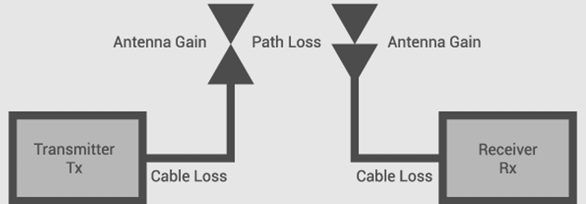
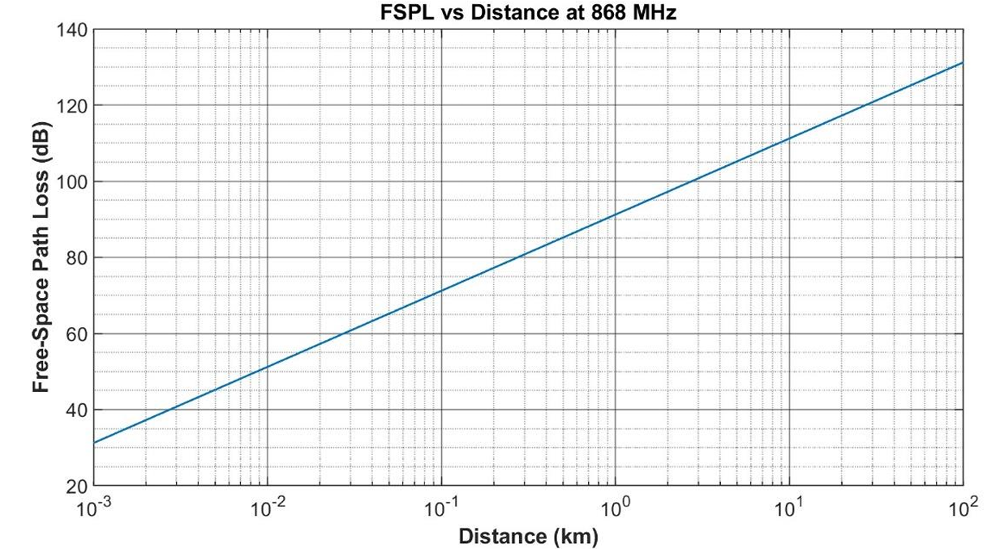
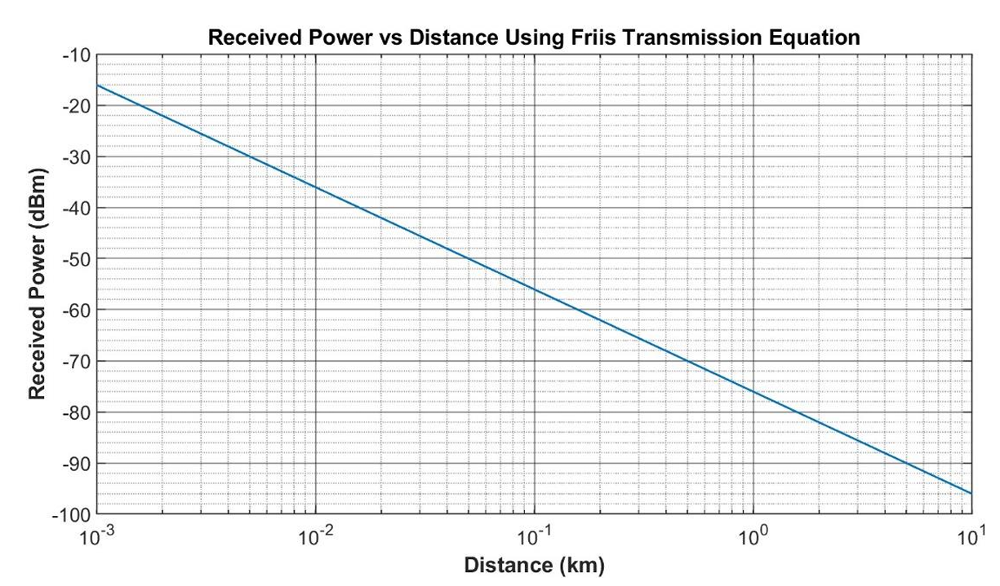
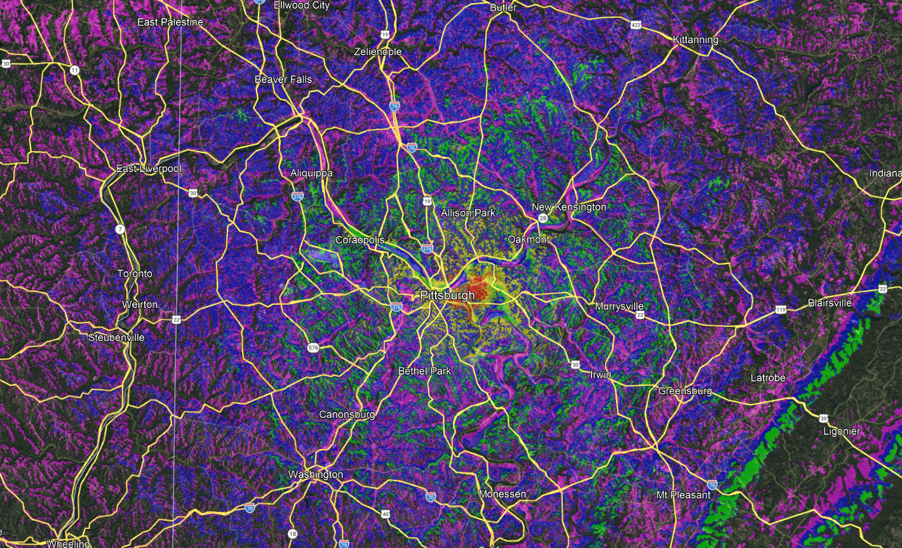
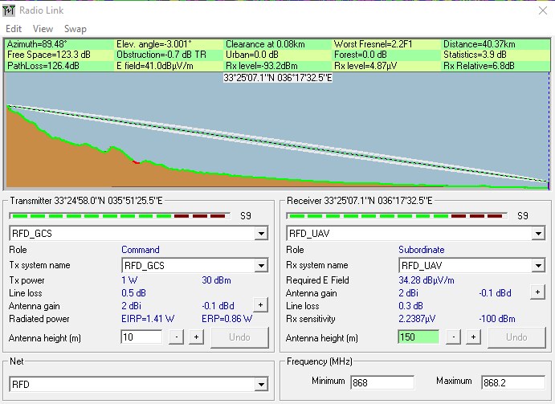

# UAV RF Telemetry Link Budget Analysis

A study of **Free-Space Path Loss (FSPL)** and its application to a real long-range telemetry link, using the **RFD868ux** modem operating in the 868 MHz ISM band as a case study. The project moves from the fundamental propagation theory to a practical link budget, then compares idealized predictions against terrain-aware coverage simulation.

---

## Table of Contents

- [Overview](#overview)
- [Theory](#theory)
  - [What FSPL Is](#what-fspl-is)
  - [Dependence on Frequency](#dependence-on-frequency)
  - [Dependence on Distance](#dependence-on-distance)
  - [Received Power (Friis)](#received-power-friis)
  - [Limitations of FSPL](#limitations-of-fspl)
- [Case Study: RFD868ux](#case-study-rfd868ux)
  - [Key Parameters](#key-parameters)
  - [Coverage Comparison](#coverage-comparison)
  - [Link Budget](#link-budget)
- [Results](#results)
- [Conclusion](#conclusion)
- [References](#references)

---

## Overview

A wireless communication system depends on reliable transmission of radio waves over distance. As waves propagate, they attenuate — a natural consequence of electromagnetic energy spreading through space — which directly affects link quality and range. Free-Space Path Loss is the most fundamental model describing this attenuation under ideal line-of-sight (LOS) conditions, and it forms the basis for radio system design, performance analysis, and link budget calculation.

This project applies FSPL theory to a practical 868 MHz telemetry device — the RFD868ux Long-Range Telemetry Modem — and combines a link budget analysis, FSPL-vs-distance characterization, and a theoretical-vs-practical coverage comparison. Together these illustrate how FSPL provides a foundation for understanding wireless performance in long-range telemetry, UAV communication, and remote sensing networks.

---

## Theory

### What FSPL Is

FSPL describes how electromagnetic waves attenuate as they propagate through ideal free space. Because transmitted energy spreads radially from the source, the power flux density falls off with the square of distance. The model assumes no obstacles, reflections, multipath, atmospheric absorption, or diffraction, making it the simplest and most fundamental propagation model.

When a transmitter radiates power, the signal expands uniformly across the surface of a sphere of area `A = 4πd²`. Since power is conserved, power density decreases as the sphere grows. The most common decibel form of FSPL is:

```
FSPL(dB) = 20·log10(d) + 20·log10(f) + 32.44
```

where `d` is distance in km and `f` is frequency in MHz. (Equivalently, with `d` in metres and `f` in Hz, the constant becomes −147.55.)

<!-- Add image here: docs/fspl-diagram.png -->


### Dependence on Frequency

FSPL increases with frequency, because higher-frequency waves have smaller wavelengths and therefore smaller effective antenna apertures:

- **Higher frequency** → higher FSPL → shorter range for the same power
- **Lower frequency** → lower FSPL → better penetration and longer range

For instance, an 868 MHz link experiences less path loss than a 2.4 GHz link over the same distance, given identical antennas.

<!-- Add image here: docs/fspl-vs-frequency.png -->


### Dependence on Distance

FSPL grows at **20 dB per decade** of distance:

- Increasing distance ×10 → +20 dB of path loss
- Halving distance → roughly −6 dB

This follows directly from the inverse-square law. Although FSPL grows logarithmically when expressed in decibels, it corresponds to a quadratic reduction in received power with distance, making path loss the dominant limiting factor in long-range links.

<!-- Add image here: docs/fspl-vs-distance.png -->


### Received Power (Friis)

FSPL ties directly to the Friis transmission equation, which gives received power as a function of distance:

```
Pr(dBm) = Pt(dBm) + Gt(dBi) + Gr(dBi) − FSPL(dB)
```

where `Pt` is transmit power, `Gt` is transmit antenna gain, and `Gr` is receive antenna gain. This relationship enables estimation of link performance, identification of maximum communication range, and evaluation of system feasibility before real-world propagation effects are considered.

<!-- Add image here: docs/received-power-vs-distance.png -->


### Limitations of FSPL

FSPL is an idealized model. It does **not** account for:

- **Multipath fading** — reflection, diffraction, and scattering create multiple paths that combine with different phases, causing rapid signal fluctuations.
- **Shadowing / obstacles** — buildings, vegetation, vehicles, and terrain can partially or fully block the LOS path, adding attenuation that typically follows a log-normal distribution.
- **Terrain effects** — hills, valleys, and uneven ground cause diffraction losses or block the path entirely; significant for long-range terrestrial links.
- **Atmospheric absorption** — attenuation from gases, rain, fog, and humidity; minimal at sub-GHz but increasingly significant at higher frequencies.
- **Polarization mismatch** — misalignment between transmit and receive antennas adds power loss not captured by FSPL.
- **Antenna orientation and height** — affect ground reflections, Fresnel-zone clearance, and effective gain along the propagation direction.
- **Fresnel zone obstruction** — partial blockage of the first Fresnel zone introduces diffraction losses even when the LOS path appears clear.

Because of these factors, **FSPL provides an upper bound** on communication range; real-world conditions always reduce the achievable range relative to FSPL predictions.

---

## Case Study: RFD868ux

The RFD868ux is a high-power long-range telemetry modem operating in the 868 MHz ISM band, capable of up to +30 dBm (1 W) output, air data rates from 12 kbit/s up to 750 kbit/s, and receive sensitivity better than −108 dBm at low data rates. The case study computes and visualizes FSPL vs distance, performs a link budget, and compares theoretical predictions against a practical coverage map.

### Key Parameters

| Parameter            | Value                                            |
| -------------------- | ------------------------------------------------ |
| Frequency            | 868 MHz                                          |
| Range                | 40 km                                            |
| Transmit Power       | 30 dBm                                           |
| Receiver Sensitivity | −108 dBm @ 12 kbit/s  ·  −93 dBm @ 224 kbit/s    |
| Antenna Gain         | Transmitter: +5 dBi  ·  Receiver: +7 dBi         |

### Coverage Comparison

Terrain-aware simulation incorporates terrain elevation, Fresnel-zone clearance, clutter losses, transmitter/receiver height, and the link budget. The example below simulates the RFD868ux from a ground control station (GCS) sited on high elevation at Mt. Hermon (Sheikh Mt.), Golan Heights.

Compared to the smooth FSPL curves, the practical coverage map shows jagged, irregular boundaries: green areas indicate strong reception (high link margin), while purple and blue areas indicate fading or near-threshold signals. The simulated coverage is smaller than the FSPL-only prediction, confirming that free-space assumptions represent only an upper bound.

<!-- Add image here: docs/coverage-map.png -->


### Link Budget

Using the Friis equation with `Pt = +30 dBm`, `Gt = +5 dBi`, and `Gr = +7 dBi` (combined gain +12 dBi):

- At 40 km, FSPL reaches **≈ 123.2 dB** — the propagation "cost" the link must overcome.
- Received power at 40 km is **≈ −93 dBm**, matching the receiver sensitivity threshold for the higher data rate (224 kbit/s): the link is viable but approaching its limit.
- For the lowest data rate (−108 dBm sensitivity), the link margin at 40 km is **≈ 15 dB**. This margin narrows with distance, leaving the system more exposed to real-world effects such as multipath fading and terrain obstruction.

<!-- Add image here: docs/radio-link.png -->


---

## Results

- FSPL increases steadily with distance and exceeds 140 dB beyond ~40 km.
- Link budget calculations indicate a maximum theoretical FSPL tolerance of ~153 dB, giving an ideal free-space range close to **100 km** at the lowest data rate.
- Increasing the data rate reduces sensitivity, which lowers the achievable range accordingly.
- Terrain-aware coverage simulation reveals practical ranges of **20–40 km**, depending on antenna height and environment.
- Real-world propagation introduces losses not captured by FSPL: diffraction, ground reflections, clutter, foliage, and non-ideal antenna alignment.

---

## Conclusion

FSPL serves as the foundation for estimating wireless communication performance. Applied to the RFD868ux, it yields an ideal theoretical range approaching 100 km, but comparison with terrain-aware simulation confirms that real-world conditions significantly reduce achievable distance. The RFD868ux remains a highly capable long-range telemetry solution, yet accurate range prediction requires combining FSPL theory with terrain-aware tools — underscoring the value of integrating both theoretical models and practical simulation into wireless system design.

---

## References

1. Over the Air Digital Television Reception — OTA DTV. https://otadtv.com/
2. RFDigital, "RFD868ux Long Range Telemetry Modem — Datasheet," RFDesign, 2024.
3. Radio Mobile — Propagation and Coverage Analysis Tool.
4. Godara, B. & Fabre, A. (2008). *A New Application of Current Conveyors: The Design of Wideband Controllable Low-Noise Amplifiers.* Radioengineering, 17.
5. Zhang, Z., Yu, Y., Li, X. & He, X. (2025). *Reliable GNSS positioning and navigation with simultaneous multipath and NLOS mitigation by using camera and C/N0 at deep canyons.* Measurement Science and Technology, 36.
6. Pittman, N. (2023). *Tuning Into the Atmosphere: How Humidity Influences AM Radio Signal Propagation.* Norcast.
7. Fresnel Zone Calculator (2017). Afar.Net.
8. Antenna orientation. Digi.Com.

---

*Prepared by Abdulrahman Albadawi — Istanbul Sabahattin Zaim University, Wireless Communication Systems, Fall 2025–2026.*
